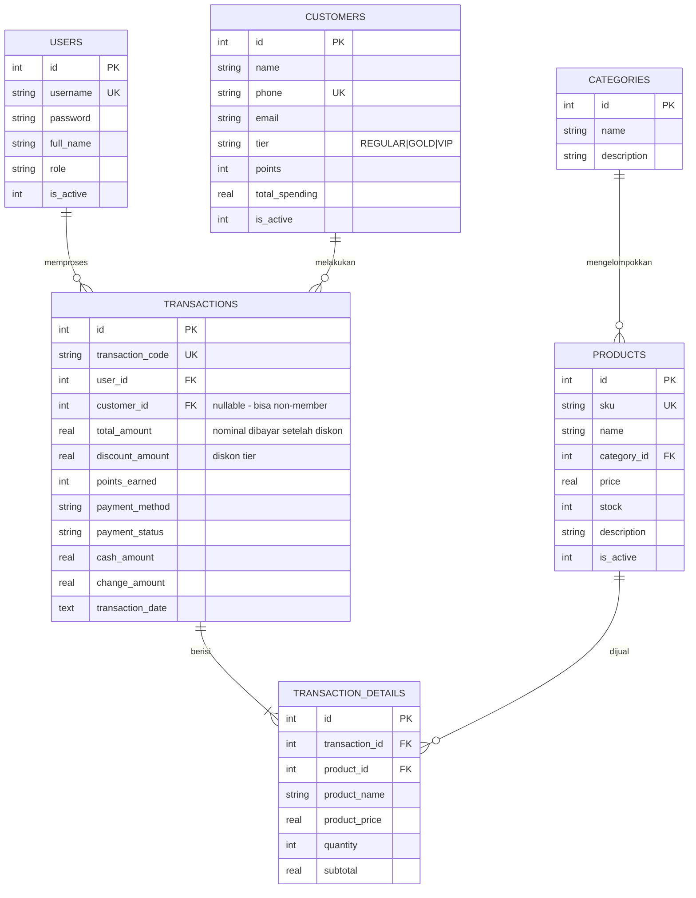
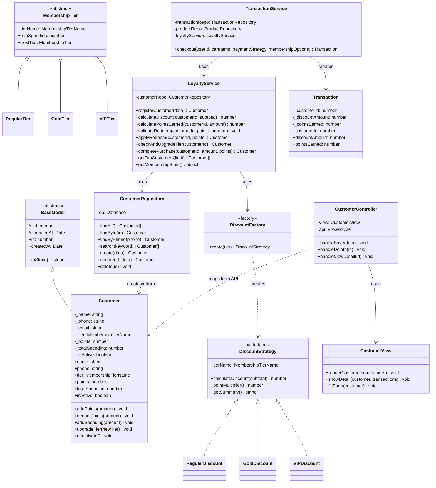

# Diagram — Modul Membership & Loyalty

## 1. ERD

```mermaid
erDiagram
    USERS ||--o{ TRANSACTIONS : "memproses"
    CUSTOMERS ||--o{ TRANSACTIONS : "melakukan"
    TRANSACTIONS ||--|{ TRANSACTION_DETAILS : "berisi"
    PRODUCTS ||--o{ TRANSACTION_DETAILS : "dijual"
    CATEGORIES ||--o{ PRODUCTS : "mengelompokkan"

    CUSTOMERS {
        int id PK
        string name
        string phone UK
        string email
        string tier "REGULAR|GOLD|VIP"
        int points
        real total_spending
        int is_active
    }

    TRANSACTIONS {
        int id PK
        string transaction_code UK
        int user_id FK
        int customer_id FK "nullable - bisa non-member"
        real total_amount "nominal dibayar setelah diskon"
        real discount_amount "diskon tier"
        int points_earned
        string payment_method
        string payment_status
        real cash_amount
        real change_amount
        text transaction_date
    }

    TRANSACTION_DETAILS {
        int id PK
        int transaction_id FK
        int product_id FK
        string product_name
        real product_price
        int quantity
        real subtotal
    }

    USERS {
        int id PK
        string username UK
        string password
        string full_name
        string role
        int is_active
    }

    PRODUCTS {
        int id PK
        string sku UK
        string name
        int category_id FK
        real price
        int stock
        string description
        int is_active
    }

    CATEGORIES {
        int id PK
        string name
        string description
    }
```

## 2. Class Diagram (Membership & Loyalty)

```mermaid
classDiagram
    class BaseModel {
        <<abstract>>
        #_id: number
        #_createdAt: Date
        +id: number
        +createdAt: Date
        +toString() string
    }

    class Customer {
        -_name: string
        -_phone: string
        -_email: string
        -_tier: MembershipTierName
        -_points: number
        -_totalSpending: number
        -_isActive: boolean
        +name: string
        +phone: string
        +tier: MembershipTierName
        +points: number
        +totalSpending: number
        +isActive: boolean
        +addPoints(amount) void
        +deductPoints(amount) void
        +addSpending(amount) void
        +upgradeTier(newTier) void
        +deactivate() void
    }

    class MembershipTier {
        <<abstract>>
        +tierName: MembershipTierName
        +minSpending: number
        +nextTier: MembershipTier
    }
    class RegularTier
    class GoldTier
    class VIPTier

    class DiscountStrategy {
        <<interface>>
        +tierName: MembershipTierName
        +calculateDiscount(subtotal) number
        +pointMultiplier() number
        +getSummary() string
    }
    class RegularDiscount
    class GoldDiscount
    class VIPDiscount

    class DiscountFactory {
        <<factory>>
        +create(tier) DiscountStrategy$
    }

    class CustomerRepository {
        -db: Database
        +findAll() Customer[]
        +findById(id) Customer
        +findByPhone(phone) Customer
        +search(keyword) Customer[]
        +create(data) Customer
        +update(id, data) Customer
        +delete(id) void
    }

    class LoyaltyService {
        -customerRepo: CustomerRepository
        +registerCustomer(data) Customer
        +calculateDiscount(customerId, subtotal) number
        +calculatePointsEarned(customerId, amount) number
        +validateRedeem(customerId, points, amount) void
        +applyRedeem(customerId, points) Customer
        +checkAndUpgradeTier(customerId) Customer
        +completePurchase(customerId, amount, points) Customer
        +getTopCustomers(limit) Customer[]
        +getMembershipStats() object
    }

    class TransactionService {
        -transactionRepo: TransactionRepository
        -productRepo: ProductRepository
        -loyaltyService: LoyaltyService
        +checkout(userId, cartItems, paymentStrategy, membershipOptions) Transaction
    }

    class Transaction {
        -_customerId: number
        -_discountAmount: number
        -_pointsEarned: number
        +customerId: number
        +discountAmount: number
        +pointsEarned: number
    }

    class CustomerController {
        -view: CustomerView
        -api: BrowserAPI
        +handleSave(data) void
        +handleDelete(id) void
        +handleViewDetail(id) void
    }

    class CustomerView {
        +renderCustomers(customers) void
        +showDetail(customer, transactions) void
        +fillForm(customer) void
    }

    BaseModel <|-- Customer
    MembershipTier <|-- RegularTier
    MembershipTier <|-- GoldTier
    MembershipTier <|-- VIPTier
    DiscountStrategy <|.. RegularDiscount
    DiscountStrategy <|.. GoldDiscount
    DiscountStrategy <|.. VIPDiscount
    DiscountFactory ..> DiscountStrategy : creates
    CustomerRepository ..> Customer : creates/returns
    LoyaltyService --> CustomerRepository : uses
    LoyaltyService --> DiscountFactory : uses
    TransactionService --> LoyaltyService : uses
    TransactionService --> Transaction : creates
    CustomerController --> CustomerView : uses
    CustomerController ..> Customer : maps from API
```

# Class Diagram — Mini POS System (Full Fitur)

```mermaid
classDiagram
    %% =====================================================
    %% LAYER 1 - MODEL
    %% =====================================================

    class BaseModel {
        <<abstract>>
        -id: number
        -createdAt: Date
        +toString() String
    }

    class User {
        -_username: string
        -_password: string
        -_fullName: string
        -_role: string
        -_isActive: boolean
        +verifyPassword() boolean
        +hasAccess() boolean
        +changePassword() void
        +getRole() string
    }

    class Admin {
        +getRole() string
        +hasAccess() boolean
    }

    class Cashier {
        -ALLOWED_FEATURES: string[]
        +getRole() string
        +hasAccess() boolean
    }

    class Product {
        -_sku: string
        -_name: string
        -_price: number
        -_stock: number
        -_categoryId: number
        -_isActive: boolean
        +isLowStock: boolean
        +deactivate() void
        +reduceStock(qty) void
        +toString() String
    }

    class Category {
        -_name: string
        -_description: string
        +getName() string
    }

    class Transaction {
        -_code: string
        -_userId: number
        -_totalAmount: number
        -_paymentMethod: string
        -_status: string
        -_customerId: number
        -_discountAmount: number
        -_pointsEarned: number
        +addItem(product, qty) void
        +calculateTotal() void
        +complete() void
        +toString() String
    }

    class CartItem {
        -_product: Product
        -_quantity: number
        +subtotal: number
        +updateQuantity() void
        +toString() string
    }

    class Customer {
        -_name: string
        -_phone: string
        -_email: string
        -_tier: MembershipTierName
        -_points: number
        -_totalSpending: number
        -_isActive: boolean
        +addPoints(amount) void
        +deductPoints(amount) void
        +addSpending(amount) void
        +upgradeTier(newTier) void
        +deactivate() void
        +toString() String
    }

    class MembershipTier {
        <<abstract>>
        +tierName: MembershipTierName
        +minSpending: number
        +nextTier: MembershipTier
    }
    class RegularTier
    class GoldTier
    class VIPTier

    BaseModel <|-- User
    BaseModel <|-- Product
    BaseModel <|-- Category
    BaseModel <|-- Transaction
    BaseModel <|-- Customer
    User <|-- Admin
    User <|-- Cashier
    Transaction "1" o-- "*" CartItem
    MembershipTier <|-- RegularTier
    MembershipTier <|-- GoldTier
    MembershipTier <|-- VIPTier

    %% =====================================================
    %% INTERFACES & STRATEGY (dipakai lintas Model/Service)
    %% =====================================================

    class PaymentStrategy {
        <<interface>>
        +methodName: string
        +processPayment(amount) PaymentResult
        +validatePayment(amount) boolean
    }
    class CashPayment {
        -cashReceived: number
        +processPayment() PaymentResult
        +validatePayment() boolean
    }
    class QRISPayment {
        +processPayment() PaymentResult
        +validatePayment() boolean
    }
    class TransferPayment {
        -bankName: string
        +processPayment() PaymentResult
        +validatePayment() boolean
    }
    class CreditCardPayment {
        +processPayment() PaymentResult
        +validatePayment() boolean
    }
    class PaymentFactory {
        <<factory>>
        +create(config) PaymentStrategy$
    }

    class DiscountStrategy {
        <<interface>>
        +tierName: MembershipTierName
        +calculateDiscount(subtotal) number
        +pointMultiplier() number
    }
    class RegularDiscount {
        +calculateDiscount() number
        +pointMultiplier() number
    }
    class GoldDiscount {
        +calculateDiscount() number
        +pointMultiplier() number
    }
    class VIPDiscount {
        +calculateDiscount() number
        +pointMultiplier() number
    }
    class DiscountFactory {
        <<factory>>
        +create(tier) DiscountStrategy$
    }

    PaymentStrategy <|.. CashPayment
    PaymentStrategy <|.. QRISPayment
    PaymentStrategy <|.. TransferPayment
    PaymentStrategy <|.. CreditCardPayment
    PaymentFactory ..> PaymentStrategy : creates

    DiscountStrategy <|.. RegularDiscount
    DiscountStrategy <|.. GoldDiscount
    DiscountStrategy <|.. VIPDiscount
    DiscountFactory ..> DiscountStrategy : creates

    %% =====================================================
    %% LAYER 2 - REPOSITORY
    %% =====================================================

    class BaseRepository {
        <<abstract>>
        -items: T[]
        +add() void
        +findById() T
        +getAll() T[]
        +delete() void
        +count() number
        +search()* T[]
    }

    class ProductRepository {
        -db: Database
        +findAll() Product[]
        +findById() Product
        +findBySku() Product
        +create() Product
        +update() Product
        +delete() void
        +search() Product[]
        +findLowStock() Product[]
    }

    class CategoryRepository {
        -db: Database
        +findAll() Category[]
        +findById() Category
        +create() Category
    }

    class UserRepository {
        -db: Database
        +findAll() User[]
        +findById() User
        +findByUsername() User
        +create() User
        +update() User
    }

    class TransactionRepository {
        -db: Database
        +findAll() Transaction[]
        +findById() Transaction
        +create() Transaction
        +findByDateRange() Transaction[]
        +findByCustomerId() Transaction[]
    }

    class CustomerRepository {
        -db: Database
        +findAll() Customer[]
        +findById() Customer
        +findByPhone() Customer
        +search() Customer[]
        +create() Customer
        +update() Customer
        +delete() void
    }

    BaseRepository <|-- ProductRepository
    BaseRepository <|-- CategoryRepository
    BaseRepository <|-- UserRepository
    BaseRepository <|-- TransactionRepository
    BaseRepository <|-- CustomerRepository

    ProductRepository ..> Product : creates/returns
    CategoryRepository ..> Category : creates/returns
    UserRepository ..> User : creates/returns
    TransactionRepository ..> Transaction : creates/returns
    CustomerRepository ..> Customer : creates/returns

    %% =====================================================
    %% LAYER 3 - SERVICE (+ Report)
    %% =====================================================

    class ProductService {
        -productRepository
        -categoryRepository
        +getAllProducts() Product[]
        +createProduct() Product
        +updateProduct() Product
        +deleteProduct() void
        +getLowStockProducts() Product[]
    }

    class CategoryService {
        -categoryRepository
        +getAllCategories() Category[]
        +createCategory() Category
        +updateCategory() Category
        +deleteCategory() void
    }

    class UserService {
        -userRepo
        +getAllUsers() User[]
        +createUser() User
        +updateUser() User
        +deleteUser() void
        +hashPassword() string
    }

    class AuthService {
        -db: Database
        -currentUser: User
        +login() void
        +logout() void
        +getCurrentUser() User
        +hashPassword() string
    }

    class TransactionService {
        -transactionRepository
        -productRepository
        -loyaltyService
        +checkout(userId, cartItems, paymentStrategy, membershipOptions) Transaction
        +getAllTransactions() Transaction[]
        +getByDateRange() Transaction[]
        +getTransactionsByCustomerId() Transaction[]
        +generateReceipt() string
    }

    class LoyaltyService {
        -customerRepo
        +registerCustomer() Customer
        +updateCustomerProfile() Customer
        +deactivateCustomer() void
        +calculateDiscount(customerId, subtotal) number
        +calculatePointsEarned(customerId, amount) number
        +validateRedeem() void
        +applyRedeem() Customer
        +checkAndUpgradeTier() Customer
        +completePurchase() Customer
        +getTopCustomers() Customer[]
        +getMembershipStats() object
    }

    class QRCodeService {
        -baseUrl: string
        +generateQR() void
        +renderQR() void
    }

    class CurrencyService {
        -cachedRate
        -CACHE_DURATION
        +getUSDRate() number
        +convertToUSD() number
        +formatAsUSD() string
    }

    class SalesReport {
        -transactions
        +totalRevenue() number
        +successfulTransactionCount() number
        +revenueByPaymentMethod() Map
        +exportToCSV() void
    }

    ProductService --> ProductRepository : uses
    ProductService --> CategoryRepository : uses
    CategoryService --> CategoryRepository : uses
    UserService --> UserRepository : uses
    AuthService --> UserRepository : uses
    TransactionService --> TransactionRepository : uses
    TransactionService --> ProductRepository : uses
    TransactionService --> PaymentFactory : uses
    TransactionService --> LoyaltyService : uses
    LoyaltyService --> CustomerRepository : uses
    LoyaltyService --> DiscountFactory : uses
    SalesReport ..> Transaction : reads

    %% =====================================================
    %% UTILITY - BrowserAPI (dipakai semua Controller)
    %% =====================================================

    class BrowserAPI {
        +login() Promise
        +productGetAll() Promise
        +productCreate() Promise
        +productDelete() Promise
        +categoryGetAll() Promise
        +transactionProcess() Promise
        +reportsGetAll() Promise
        +userGetAll() Promise
        +customerGetAll() Promise
        +customerSearch() Promise
        +customerCreate() Promise
        +customerUpdate() Promise
        +customerDelete() Promise
        +customerTransactions() Promise
        +loyaltyTopCustomers() Promise
    }

    %% =====================================================
    %% LAYER 4 - VIEW
    %% =====================================================

    class ProductView {
        -tableBody
        -form
        -searchInput
        +renderProducts() void
        +fillForm() void
        +showSuccess() void
        +showError() void
        +resetForm() void
    }

    class CategoryView {
        -tableBody
        -form
        +renderCategories() void
        +showSuccess() void
        +showError() void
    }

    class UserView {
        -tableBody
        -form
        +renderUsers() void
        +fillForm() void
        +showSuccess() void
        +showError() void
    }

    class DashboardView {
        +renderMetrics() void
        +renderLowStockTable() void
        +renderMembershipStats() void
        +renderTopCustomers() void
    }

    class TransactionView {
        +renderProducts() void
        +renderCart() void
        +renderMemberResults() void
        +showSelectedMember() void
        +getRedeemPoints() number
    }

    class PaymentModal {
        -modalEl
        -qrService
        +show() void
        +close() void
    }

    class ReceiptView {
        +show(transaction) void
    }

    class ReportView {
        -tableBody
        -startDateInput
        -endDateInput
        +renderReport() void
    }

    class CustomerView {
        -tableBody
        -form
        -detailModal
        +renderCustomers() void
        +showDetail(customer, transactions) void
        +fillForm() void
        +showSuccess() void
        +showError() void
    }

    %% =====================================================
    %% LAYER 5 - CONTROLLER
    %% =====================================================

    class ProductController {
        -view: ProductView
        -api: BrowserAPI
        +loadProducts() void
        +handleSave() void
        +handleDelete() void
        +handleEdit() void
    }

    class CategoryController {
        -view: CategoryView
        -api: BrowserAPI
        +loadCategories() void
        +handleSave() void
        +handleDelete() void
    }

    class UserController {
        -view: UserView
        -api: BrowserAPI
        +loadUsers() void
        +handleSave() void
        +handleDelete() void
        +handleEdit() void
    }

    class DashboardController {
        -view: DashboardView
        -api: BrowserAPI
        +loadReports() void
        +loadTopCustomers() void
    }

    class TransactionController {
        -view: TransactionView
        -api: BrowserAPI
        -cart: CartItem[]
        -selectedCustomer
        +loadProducts() void
        +handleAddToCart() void
        +handleCheckout() void
        +handleMemberSearch() void
        +handleSelectMember() void
    }

    class ReportController {
        -view: ReportView
        -api: BrowserAPI
        +handleFilter() void
        +handleExport() void
    }

    class CustomerController {
        -view: CustomerView
        -api: BrowserAPI
        +loadCustomers() void
        +handleSave() void
        +handleDelete() void
        +handleEdit() void
        +handleViewDetail() void
    }

    ProductController --> ProductView : uses
    ProductController --> BrowserAPI : uses
    CategoryController --> CategoryView : uses
    CategoryController --> BrowserAPI : uses
    UserController --> UserView : uses
    UserController --> BrowserAPI : uses
    DashboardController --> DashboardView : uses
    DashboardController --> BrowserAPI : uses
    TransactionController --> TransactionView : uses
    TransactionController --> BrowserAPI : uses
    TransactionController --> PaymentModal : uses
    TransactionController --> ReceiptView : uses
    TransactionController --> CartItem : manages
    ReportController --> ReportView : uses
    ReportController --> BrowserAPI : uses
    ReportView ..> SalesReport : uses
    CustomerController --> CustomerView : uses
    CustomerController --> BrowserAPI : uses
```
